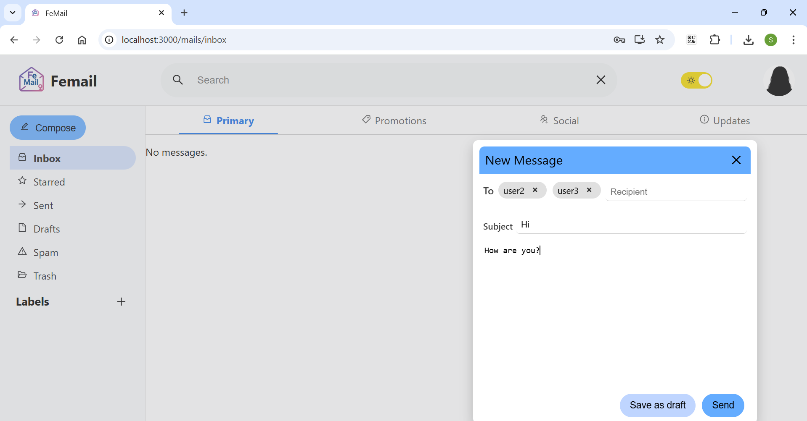

# FeMail-Part4 - Full Gmail-like React App with REST API Integration

## Overview

FeMail-Part4 is the penultimate part of the FeMail project. It presents a **fully functional webmail application built with React**, styled and organized like the real Gmail. It allows users to register, log in, send/receive/edit emails, manage labels, search mails, and switch between inbox, drafts, sent, and spam—all with a live REST API backend.

This part connects the frontend to the backend server (built in Node.js), which itself communicates with a C++ TCP blacklist server to filter spam links in real-time.

The frontend is entirely dynamic and **does not use any hardcoded content**. All data (mails, labels, user info) is fetched and rendered based on server responses. All requests requiring authentication are protected via a JWT token.

## Features
###  Authentication
- Register/Login: Via dedicated forms with input validation
- JWT Tokens: Secured authentication for protected endpoints

###  Mail Management
- Inbox, Drafts, Sent, Spam views
- Send new mail (integrated blacklist check)
- Edit & delete drafts
- Search mails by keyword

###  Labels
- Create, update, delete labels
- Assign labels to mails

###  Search
- Live search across mail subject, body, sender, and recipient

###  Blacklist Filter (C++ server)
- Mails with dangerous URLs are filtered to spam
- TCP socket connection between web server and blacklist server

###  UI Features
- Gmail-like layout with sidebar, topbar, and dynamic views
- Light/Dark mode toggle
- Responsive feedback messages and error handling

## Technologies Used
| Layer        | Technology                    |
|--------------|-------------------------------|
| Frontend     | React, CSS, HTML, JS          |
| Backend API  | Node.js, Express              |
| Blacklist    | C++ Bloom Filter via TCP      |
| Infra        | Docker, Docker Compose        |
| Management   | GitHub, JIRA                  |

## Project Structure
* `src/blacklist/` - Bloom filter functionality with TCP server
* `src/femail-web/` - React app for web-based email
* `src/nodejs-server/` - Node.js API server using MVC structure (models, controllers, routes)
* `src/nodejs-server/utils/` - Client socket utility to talk to blacklist server
* `src/tests/` - Contains the tests code to check the the blacklist functionality
* `data/` - Bloom filter data files

## Setup and Usage
1. Clone the repository:
   ```bash
   git clone https://github.com/Fisher-Shira/FeMail-Part4.git
2. Navigate to the project directory:
   ```bash
    cd FeMail-Part4

## Run the Project (starting in FeMail-Part4 directory)
1. Open Docker Desktop in your computer
2. Run the app using docker-compose
    * If the blacklist server is on localhost:
      * On Linux:
        ```bash
        BLACKLIST_IP=host.docker.internal BLACKLIST_PORT=<blacklist_port> NUM_OF_BITS=<num_of_bits> HASH_ARGS="<hash1> <hash2> ..." docker-compose up --build
        ```
      * On Windows:
        ```bash
        $env:BLACKLIST_IP="host.docker.internal"; $env:BLACKLIST_PORT="<blacklist_port>"; $env:NUM_OF_BITS="<num_of_bits>"; $env:HASH_ARGS="<hash1> <hash2> ..."; docker-compose up --build
        ```
    * If the blacklist server is on another machine:
      * On Linux:
        ```bash
        BLACKLIST_IP=<blacklist_ip> BLACKLIST_PORT=<blacklist_port> NUM_OF_BITS=<num_of_bits> HASH_ARGS="<hash1> <hash2> ..." docker-compose up --build
        ```
      * On Windows:
        ```bash
        $env:BLACKLIST_IP="<blacklist_ip>"; $env:BLACKLIST_PORT="<blacklist_port>"; $env:NUM_OF_BITS="<num_of_bits>"; $env:HASH_ARGS="<hash1> <hash2> ..."; docker-compose up --build
        ```
    **Fields explanation**
    * Put your fields instead of the <...>
    * All fields are mendetory
    * The fields:
      * BLACKLIST_IP - The ip that the blacklist server is running on
        * Find your ip:<br>
        'hostname -l' command on Linux<br>
        'ipconfig' command on Windows
      * BLACKLIST_PORT - The wanted port you want the blacklist server to run on
      * NUM_OF_BITS - The number of bits for the Bloom filter array
      * HASH_ARGS - Series of numbers that describe the hash (as many hashes as you want)
    
    **Clarifications**
    * The Node.js (web) server port will be 8080, The React app port will be 3000.
    * please make sure these ports (8080, 3000) are avilables for use
    * Do not include the '<' '>' or '...' symbols in your command
3. Wait for the docker to complete his running, you will see a message 'webpack compiled ...' on the terminal
4. In your browser open http://localhost:3000 or http://<your_ip>:3000
5. Start using the app

## Known Limitations
* Data is stored in-memory, no persistence on server restart (except blacklist URLs)

## Design Principles
SPA with React Router<br>
useState/useEffect hooks<br>
Stateful UI for interactive UX<br>
Token persistence via localStorage<br>
Proper error handling and user feedback<br>
Responsive design for real usage

## Running Example





