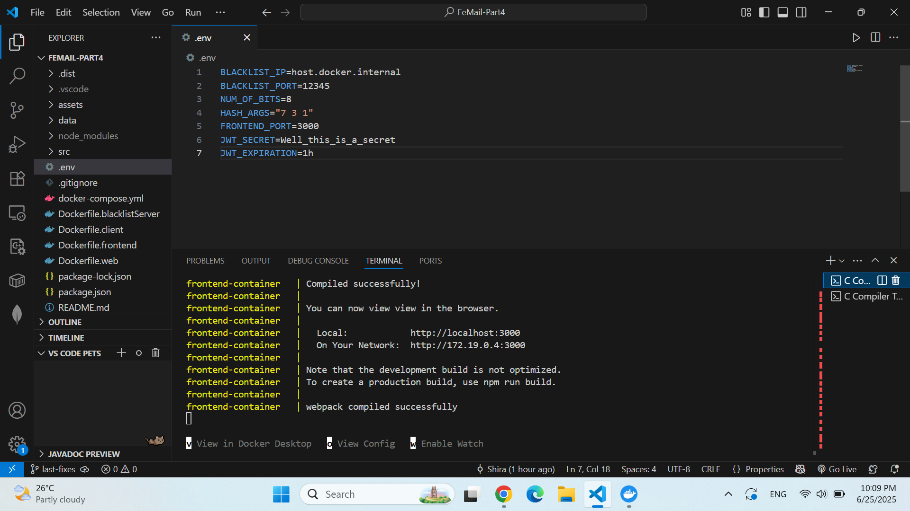
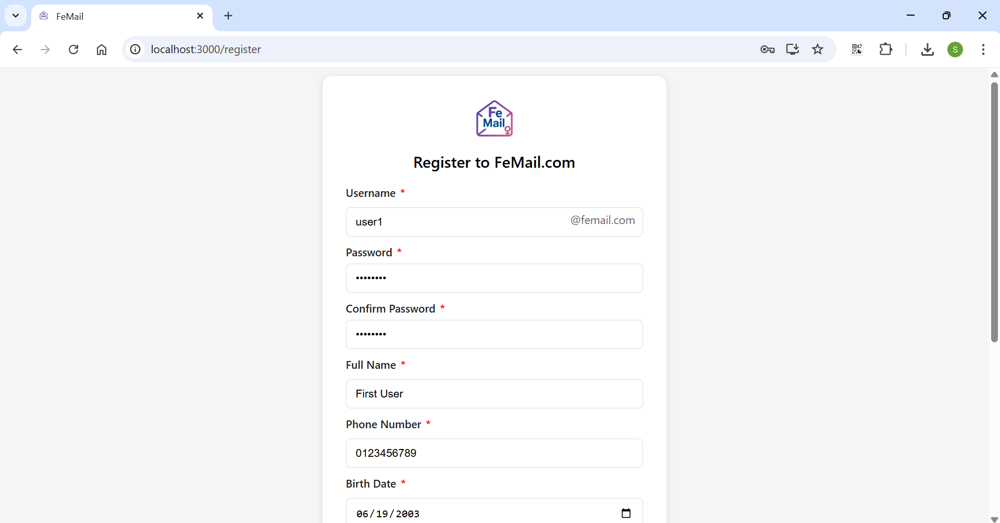
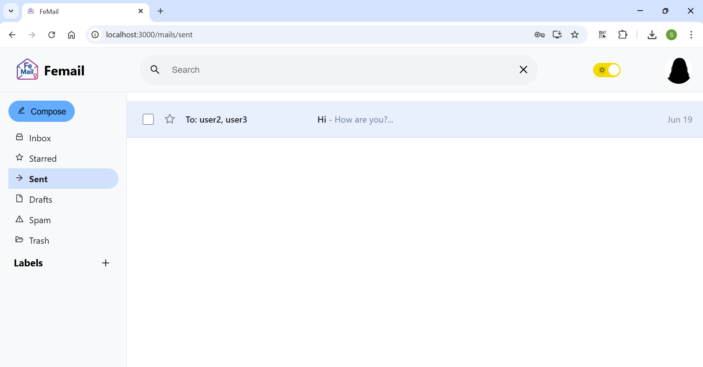
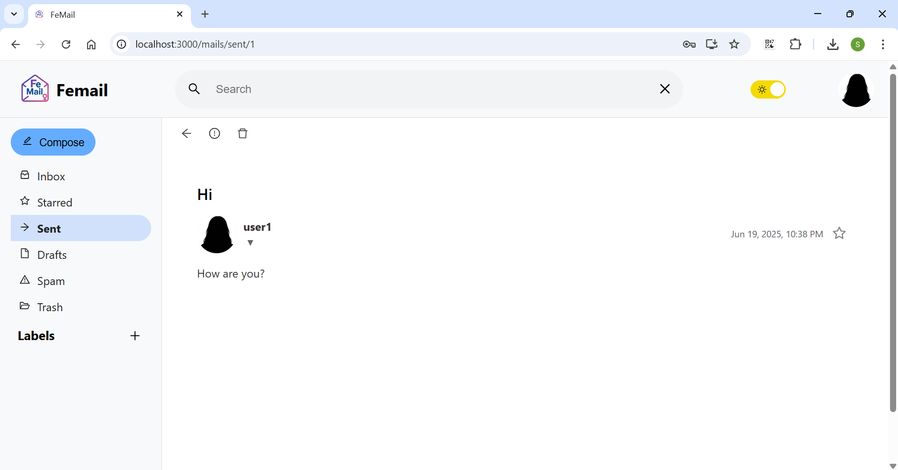
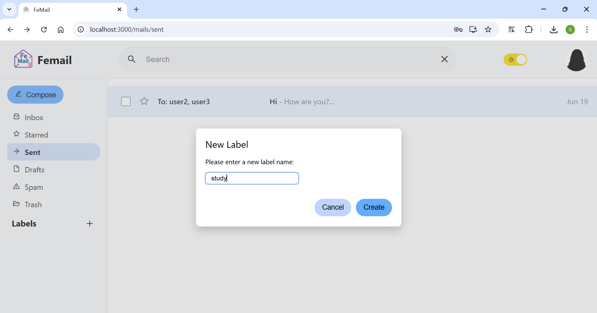

# FeMail-Part4 - Full Gmail-like React App with REST API Integration

## Overview

FeMail-Part4 is the penultimate part of the FeMail project. It presents a **fully functional webmail application built with React**, styled and organized like the real Gmail. It allows users to register, log in, send/receive/edit emails, manage labels, search mails, and switch between inbox, drafts, sent, and spam—all with a live REST API backend.

This part connects the frontend to the backend server (built in Node.js), which itself communicates with a C++ TCP blacklist server to filter spam links in real-time.

The frontend is entirely dynamic and **does not use any hardcoded content**. All data (mails, labels, user info) is fetched and rendered based on server responses. All requests requiring authentication are protected via a JWT token.

## Features
###  Authentication
- Register/Login: Via dedicated forms with input validation
- JWT Tokens: Secured authentication for protected endpoints

###  Mail Management
- Inbox, Drafts, Sent, Spam, Star views
- Send new mail (integrated blacklist check)
- Edit & delete drafts
- Search mails by keyword

###  Labels
- Create, update, delete labels
- Assign labels to mails

###  Search
- Live search across mail subject, body, sender, and recipient

###  Blacklist Filter (C++ server)
- Mails with dangerous URLs are filtered to spam
- TCP socket connection between web server and blacklist server

###  UI Features
- Gmail-like layout with sidebar, topbar, and dynamic views
- Light/Dark mode toggle
- Responsive feedback messages and error handling

## Technologies Used
| Layer        | Technology                    |
|--------------|-------------------------------|
| Frontend     | React, CSS, HTML, JS          |
| Backend API  | Node.js, Express              |
| Blacklist    | C++ Bloom Filter via TCP      |
| Infra        | Docker, Docker Compose        |
| Management   | GitHub, JIRA                  |

## Project Structure
* `src/blacklist/` - Bloom filter functionality with TCP server
* `src/femail-web/` - React app for web-based email
* `src/nodejs-server/` - Node.js API server using MVC structure (models, controllers, routes)
* `src/nodejs-server/utils/` - Client socket utility to talk to blacklist server
* `src/tests/` - Contains the tests code to check the the blacklist functionality
* `data/` - Bloom filter data files

## Setup and Usage
1. Clone the repository:
   ```bash
   git clone https://github.com/Fisher-Shira/FeMail-Part4.git
2. Navigate to the project directory:
   ```bash
    cd FeMail-Part4

## Run the Project (starting in FeMail-Part4 directory)
1. Open Docker Desktop in your computer
2. Change .env file as you wish<br>
    **Fields explanation**
    * All fields are mendetory, don't delete any of the given fields
    * The fields:
      * BLACKLIST_IP - The ip that the blacklist server is running on
        * If the blacklist server is on localhost use host.docker.internal
        * Else, find your ip:<br>
        'hostname -l' command on Linux<br>
        'ipconfig' command on Windows
      * BLACKLIST_PORT - The wanted port you want the blacklist server to run on
      * NUM_OF_BITS - The number of bits for the Bloom filter array
      * HASH_ARGS - Series of numbers that describe the hash (as many hashes as you want)
      * FRONTEND_PORT - The wanted port you want the frontend to run on
3. Run the app using docker-compose (Both on Linux and Windows)
    ```bash
    docker-compose up --build
    ```
    **Clarifications**
    * The Node.js (web) server runs on port 8080.
    * Please make sure that this port **8080** is available on your machine (i.e., not used by other applications or blocked by firewall) and don't use this port in the .env file
4. Wait for Docker Compose to finish starting all the containers (blacklistserver, web. frontend)  
   Once everything is up, you’ll see the message:
   "webpack compiled successfully" — indicating that the app is ready
5. Open your browser and go to:
   - `http://localhost:FRONTEND_PORT` — to access the web app from your local machine  
   - Or `http://<your-ip>:FRONTEND_PORT` — to access it from another device on the same network
   * FRONTEND_PORT is the same port as part 2 in the current secrion (section 'Run the Project')
6. You can now start using the full application

## Known Limitations
* Data is stored in-memory, no persistence on server restart (except blacklist URLs)

## Design Principles
SPA with React Router<br>
useState/useEffect hooks<br>
Stateful UI for interactive UX<br>
Token persistence via localStorage<br>
Proper error handling and user feedback<br>
Responsive design for real usage

## Running Example











