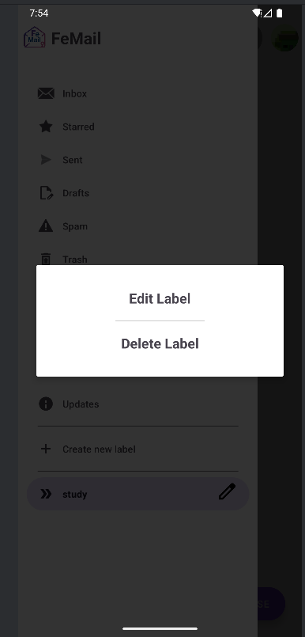

# 🚀 Android Usage Guide
Make sure you have completed all the necessary steps as described in [wiki/setup&deploy](setup&deploy.md).

## 🔐 Registration and Login

### 🔓 Login
- If you don't have a FeMail account, click **"Register here"** to create one (you will be redirected to the register screen).
- If you already have a FeMail account, fill in your username and password and click the **"Login"** button. 

  
- After logging in, you will see the main mail app screen.

### 📝 Register
- Complete the registration form with the required details and click the **Sign Up** button.  

        
- Return to the login screen, fill in your username and password, and click **Login**.
- You will be redirected to the main mail app screen.

---

## ✉️ Mails Main App Screen

  

### 👤 Profile
- Click your account picture at the top-right corner to view your profile.
- Click **Log Out** to sign out from the account.  

  

### 📧 Sending, Receiving, Viewing, and Editing Mails

- Click the **"Compose"** floating button at the bottom-right to create a new mail.

  

- Fill in recipients, subject, and body.

- Click **Send** to send, or **Save as Draft** to save without sending.  

     

- Use the sidebar menu to switch between mail categories (Inbox, Sent, Drafts, etc.).  

  

- Click any mail to view its full content.  

  

- Select multiple mails for bulk actions (Delete, Mark as Spam, Move to Label, etc.).  

  

- Use the ⭐ icon to mark starred mails.  

     

- In the **Drafts** section, click a draft mail to edit it. Then, choose to **Save** or **Send**. 

     

- Use the **Spam** icon to spam mails. 

     

- Use the **Trash** icon to spam mails.

  

---

## 🏷️ Labels

- Click the **"+"** button next to **Labels** in the sidebar to create a new label.
- Enter a label name and click **Create** or **Cancel**.  

     

- Click on a label in the sidebar to filter mails by that label.  

  

- Click the three-dot menu next to any label to **Edit** or **Delete** it.  

  

- Confirm or cancel deleting the label.  

  

---

## 🌙 Dark Mode

- Toggle between light and dark mode using the switch in the top bar.  

  
